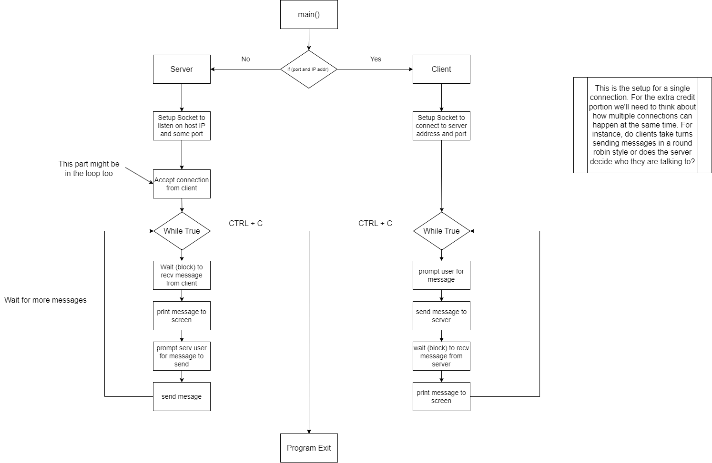

# Design

## Program flowchart

## Client
The flowing bullets are from the assignment writeup:

1. Set up a TCP connection to the server on the IP and port specified.
2. Prompt the user for a message to send.
3. Send the message to the server.
4. Block to receive a message from the server.
5. Receive message and print to screen.
6. GOTO step 2.

## Server
The flowing bullets are from the assignment writeup:

1. Set up a TCP port and listen for connections (print out IP and PORT is listening on).
2. Accept connection from client
3. Block to receive a message from the client.
4. Receive message and print to screen.
5. Prompt the user for a message to send.
6. Send the message to the client.
7. GOTO step 3.
